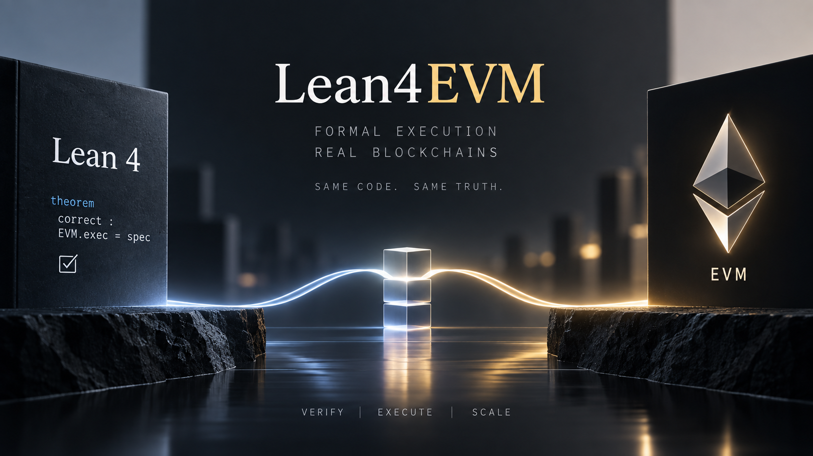

  

  <h1>mrLSD<code>/Lean4EVM</code></h1>
  
<strong>A pure Lean 4 implementation of the Ethereum Virtual Machine, formally verified in Lean</strong>

---

**Lean4EVM** implements the Ethereum Virtual Machine entirely in Lean 4, so that the executable code
and its correctness proofs are one and the same artifact. Every primitive is a nominal fixed-width
type whose wrapping arithmetic, zero-divisor semantics, byte order and conversion boundaries are
stated as machine-checked theorems instead of assumed, and the semantics are held to the Ethereum
execution specification by a differential test on every commit. The result is meant to serve as both
a reference implementation and the foundation for proving properties of transaction and block
execution.

## [MIT LICENSE](LICENSE)
